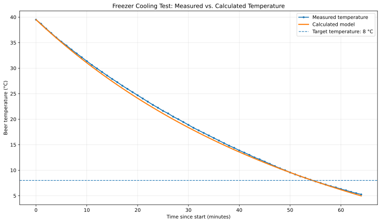

# BierCHILLER

BierCHILLER is a native Android application for estimating the cooling time of bottled beer in a refrigerator or freezer and for starting a reliable Android alarm at the calculated target time. The project combines a compact thermodynamic cooling model with a fullscreen mobile user interface optimized for quick use at home.

## Scientific Model

The cooling calculation is based on a lumped-capacitance approximation of a beer bottle or can. The drink and container are treated as one thermally well-mixed body, while the surrounding refrigerator or freezer air is modeled as a constant-temperature reservoir.

The implemented model follows the free-convection derivation used for a horizontal cylindrical container:

$$
\theta = \frac{T - T_L}{T_a - T_L}
$$

$$
\frac{d\theta}{d\tau} + \theta^{5/4} = 0
$$

$$
\theta(\tau) = \left(\frac{4}{\tau + 4}\right)^4
$$

Where:

- `T` is the current beer temperature.
- `T_a` is the initial beer temperature.
- `T_L` is the device temperature, such as freezer or refrigerator temperature.
- `\theta` is the dimensionless temperature difference.
- `\tau` is the dimensionless cooling time.

For a requested target temperature `T_e`, the target state is:

$$
\theta_e = \frac{T_e - T_L}{T_a - T_L}
$$

$$
\tau_e = 4 \cdot \left(\theta_e^{-1/4} - 1\right)
$$

The app maps this dimensionless time to minutes through an empirically calibrated cooling-rate constant and container-size factors. This keeps the physically motivated curve shape from the free-convection model while allowing practical calibration for real household refrigerators, freezers, bottle sizes, can sizes, placement, airflow, and glass geometry.

During an active timer, BierCHILLER uses the same curve to estimate and display the current beer temperature:

$$
T(t) = T_L + (T_a - T_L) \cdot \left(\frac{4}{\tau + 4}\right)^4
$$

### Measured vs. Calculated

The calibration target for the 0.33 l glass bottle is documented in the figure below.

## Help Pages

The in-app help section is localized and loaded from the matching markdown file in `app/src/main/assets/help/`. Each locale keeps the same structure and formulas, so the GitHub markdown stays readable and consistent while the Android app renders the formulas locally with KaTeX.

## Assumptions And Limits

The model intentionally abstracts real cooling behavior. The result is an estimate, not a laboratory measurement.

Main assumptions:

- Beer and bottle glass are represented by one average temperature.
- The device air temperature is constant during the cooling process.
- Bottle orientation and geometry are approximated by a cylindrical model.
- Heat transfer is dominated by convection between bottle and air.
- Bottle-size corrections are applied by empirical scaling factors.

Practical deviations can occur because domestic freezers cycle, air movement varies, bottles differ in shape and wall thickness, and the starting temperature may not be uniform.

## Android Features

- Standby-safe alarm scheduling through Android alarm APIs.
- Persistent timer state across app restarts.
- Persistent bottle size, device mode, temperature settings, and visual mode.
- Portrait and landscape layouts.
- Classic UI and beer-background visual mode.
- Multilingual interface.
- Localized in-app help pages with scientific model documentation.
- Google Play compatible package name: `com.bierchiller.app`.
- Release builds target the current Android SDK line used by the project.

## Release Artifacts

The current release artifacts are generated locally and live in these paths:

- APK: `app/build/outputs/apk/release/app-release.apk`
- AAB: `app/build/outputs/bundle/release/app-release.aab`

These files are recreated on each release build and are not meant to be edited by hand.
