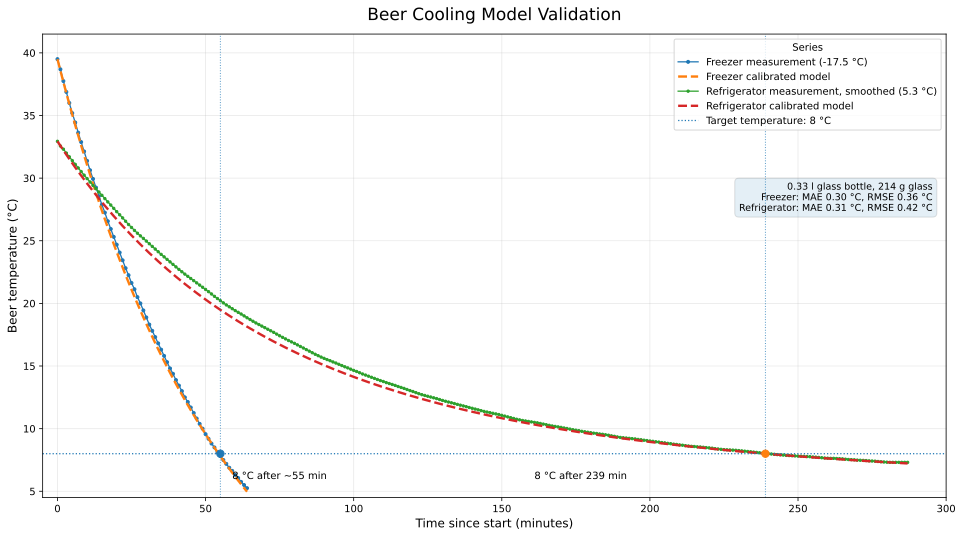

# BierCHILLER

BierCHILLER is a native Android application for estimating the cooling time of bottled beer in a refrigerator or freezer and for starting a reliable Android alarm at the calculated target time. The project combines a compact thermodynamic cooling model with a fullscreen mobile user interface optimized for quick use at home.

## Scientific Model

The cooling calculation uses the **BeerChiller Calibrated V2** model. The drink and container are treated as one practical cooling system, while the surrounding refrigerator or freezer air is modeled as a constant-temperature reservoir.

The model uses the temperature difference between beer and device:

$$
\Delta_0 = T_0 - T_D
$$

$$
\theta = \frac{T_Z - T_D}{T_0 - T_D}
$$

Where:

- `T_0` is the initial beer temperature.
- `T_Z` is the requested target temperature.
- `T_D` is the device temperature, such as freezer or refrigerator temperature.
- `\Delta_0` is the starting temperature difference to the device.
- `\theta` is the dimensionless target ratio.

BeerCHILLER uses a calibrated temperature-dependent cooling curve with the empirical exponent:

$$
n = 0.15
$$

The final app formula is:

$$
t =
\tau_0
\cdot f_D
\cdot f_P
\cdot
\left(\frac{25}{T_0-T_D}\right)^{0.15}
\cdot
\frac{
\left(
\frac{T_Z-T_D}{T_0-T_D}
\right)^{-0.15}
-1
}{0.15}
$$

The app rounds the result up to full minutes:

$$
t_{app}=\lceil t \rceil
$$

During an active timer, BierCHILLER uses the same curve to estimate and display the current beer temperature:

$$
\theta(t)=
\left(
1+n\cdot\frac{t}{\tau_{eff}}
\right)^{-1/n}
$$

$$
T(t)=T_D+(T_0-T_D)\cdot\theta(t)
$$

The calibrated constants are:

| Container | Volume | `tau_0` |
|---|---:|---:|
| Bottle | 0.33 l | 87 min |
| Bottle | 0.5 l | 110 min |
| Bottle | 1.0 l | 155 min |
| Can | 0.33 l | 85 min |
| Can | 0.5 l | 105 min |

| Device | `f_D` |
|---|---:|
| Refrigerator | 1.00 |
| Freezer | 0.84 |

| Container | Standing `f_P` | Lying `f_P` |
|---|---:|---:|
| Bottle | 1.00 | 0.95 |
| Can | 1.00 | 0.92 |

### Cooling Model Validation

The chart compares measured beer temperature data with the calibrated cooling model.
Both tests were performed with a 0.33 l glass bottle with a glass mass of 214 g.

- Freezer test: ambient temperature approx. -17.5 °C
- Refrigerator test: ambient temperature approx. 5.3 °C
- Target temperature: 8 °C
- Small refrigerator door-opening artifacts were smoothed

## Help Pages

The in-app help section is localized and loaded from the matching markdown file in `app/src/main/assets/help/`. Each locale keeps the same structure and formulas, so the GitHub markdown stays readable and consistent while the Android app renders the formulas locally with KaTeX.

## Assumptions And Limits

The model intentionally abstracts real cooling behavior. The result is an estimate, not a laboratory measurement.

Main assumptions:

- Beer and container are represented by one average temperature.
- The device air temperature is constant during the cooling process.
- Cooling slows down as the beer approaches the device temperature.
- Container size is represented by calibrated base time values.
- Device type and container position are represented by empirical factors.

Practical deviations can occur because domestic freezers cycle, air movement varies, bottles differ in shape and wall thickness, and the starting temperature may not be uniform.

## Android Features

- Standby-safe alarm scheduling through Android alarm APIs.
- Persistent timer state across app restarts.
- Persistent bottle size, device mode, temperature settings, and visual mode.
- Portrait and landscape layouts.
- Classic UI and beer-background visual mode.
- Multilingual interface.
- Localized in-app help pages with scientific model documentation.
- Google Play compatible package name: `com.bierchiller.app`.
- Release builds target the current Android SDK line used by the project.

## Release Artifacts

The current release artifacts are generated locally and live in these paths:

- APK: `app/build/outputs/apk/release/app-release.apk`
- AAB: `app/build/outputs/bundle/release/app-release.aab`

These files are recreated on each release build and are not meant to be edited by hand.
